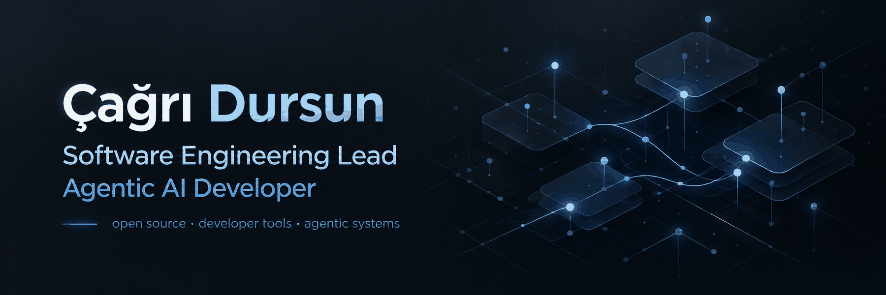

  

  Building practical AI agents, developer tools, open-source projects, and experimental software.

  
  
  
  

  <a href="https://cagridursun.com">Website</a>
  ·
  <a href="https://www.linkedin.com/in/cagridursun">LinkedIn</a>
  ·
  <a href="https://x.com/c__dursun">X</a>

---

## Selected Work

### 🤖 Agentic Developer Handbook

A Java-first open-source handbook for understanding and building agentic systems, one concept at a time.

  
  
  
  
  

[Explore the repository →](https://github.com/cagridursun/agentic-developer-handbook)

---

### 🎮 DevCade

A cross-platform terminal arcade built in Go with seven playable games, global leaderboards, package-manager distribution, localization, and a terminal-native UI.

  
  
  
  

[Repository →](https://github.com/cagridursun/devcade) ·
[Website →](https://cagridursun.github.io/devcade/)

---

### 🧠 AI Peer Live Coding Agent

An AI-assisted live-coding workflow built around structured delivery, guardrails, incremental implementation, and developer ownership.

  
  
  

[Explore the repository →](https://github.com/cagridursun/ai-peer-live-coding-agent)

---

## Current Focus

  
  
  
  
  
  

I’m particularly interested in the engineering around AI systems: how agents use tools, memory, context, external capabilities, evaluation, and controlled autonomy.

---

## Engineering

  
  
  
  

---

## Elsewhere

  <a href="https://cagridursun.com">Website</a>
  ·
  <a href="https://github.com/cagridursun">GitHub</a>
  ·
  <a href="https://www.linkedin.com/in/cagridursun">LinkedIn</a>
  ·
  <a href="https://x.com/c__dursun">X</a>

